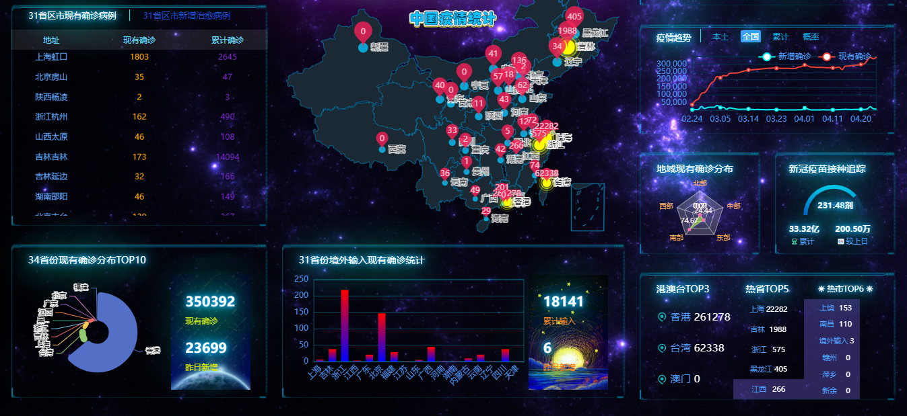

[](https://github.com/Vogadero/EpidemicStatisticsTable)


# 项目简介🚩

- 中国疫情统计
- 演示地址：https://vogadero.github.io/ChineseEpidemicStatistics/

## 1. 功能模块🎨

#### 1.1 首页🛫

| 功能                 |
| -------------------- |
| 展示中国疫情统计数据 |

## 2. 截图⭐



## 3. 项目架构🍽️

| 系统分层 | 使用技术                                   |
| -------- | ------------------------------------------ |
| 客户端   | Art-template、jQuery、EChart、lib-flexible |

## 4. 项目运行环境搭建🌈

- 克隆远端数据仓库到本地：`git clone 仓库地址`
- 拉取远程仓库中最新的版本：`git pull 远程仓库地址 分支名称`
- 双击index.html

# 功能介绍🦷

## 🕵️‍♀️标题

- 展示内容：昨日本土新增、境外输入、港澳台病例数

- API

  - 地址：https://view.inews.qq.com/g2/getOnsInfo

  - 方式：GET

  - 参数类型：jsonp

  - 参数：

    | 参数名 | 说明                     |
    | ------ | ------------------------ |
    | name   | wuwei_ww_ww_today_notice |

    

## :card_index:**中国疫情总概**

- 展示内容：本土现有确诊(不含港澳台、不含境外输入)；现有确诊(含港澳台)；累计确诊和现有疑似病例

- API

  - 地址：https://api.inews.qq.com/newsqa/v1/query/inner/publish/modules/list

  - 方式：GET

  - 参数：

    | 参数名  | 说明                                 |
    | ------- | ------------------------------------ |
    | modules | statisGradeCityDetail,diseaseh5Shelf |

    


## :woman_technologist:**国内外新冠疫苗接种追踪**

- 展示内容：国内外累计接种数；较上日新增数；每百人接种数

- API

  - 地址：https://api.inews.qq.com/newsqa/v1/automation/modules/list

  - 方式：GET

  - 参数：

    | 参数名  | 说明           |
    | ------- | -------------- |
    | modules | VaccineTopData |


## :six_pointed_star:近期31省市区病例

- 展示内容：近期31省市区地址、现有确诊、累计确诊、新增确诊以及治愈病例数据

- API

  - 地址：https://api.inews.qq.com/newsqa/v1/query/inner/publish/modules/list

  - 方式：GET

  - 参数：

    | 参数名  | 说明                                 |
    | ------- | ------------------------------------ |
    | modules | statisGradeCityDetail,diseaseh5Shelf |


## :thermometer:**34省份现有确诊分布TOP10**

- 展示内容：34省份现有确诊分布TOP10饼状图、现有确诊以及昨日新增病例数据

- API

  - 地址：https://api.inews.qq.com/newsqa/v1/query/inner/publish/modules/list

  - 方式：GET

  - 参数类型：json

  - 参数：
  
    | 参数名  | 说明                                 |
    | ------- | ------------------------------------ |
    | modules | statisGradeCityDetail,diseaseh5Shelf |


## :four_leaf_clover:**34省份现有确诊地图**

- 展示内容：34省份现有确诊地图分布
- API
  - 地址：https://eyesight.news.qq.com/sars/riskarea
  - 方式：GET
  - 参数类型：jsonp


## :sunrise_over_mountains:中国疫情分概

- 展示内容：无症状感染者；重症感染者；治愈以及累计死亡病例数据

- API

  - 地址：https://api.inews.qq.com/newsqa/v1/query/inner/publish/modules/list

  - 方式：GET

  - 参数类型：json

  - 参数：

    | 参数名  | 说明                                 |
    | ------- | ------------------------------------ |
    | modules | statisGradeCityDetail,diseaseh5Shelf |


## 👩‍🚒疫情趋势60天折线图

- 展示内容：本土新增确诊和现有确诊变化趋势；全国新增确诊和现有确诊变化趋势；全国累计确诊和累计治愈变化趋势；治愈率和病死率变化趋势

- API

  - 地址：https://api.inews.qq.com/newsqa/v1/query/inner/publish/modules/list

  - 方式：GET

  - 参数：

    | 参数名  | 说明                                                         |
    | ------- | ------------------------------------------------------------ |
    | modules | chinaDayList,chinaDayAddList,nowConfirmStatis,provinceCompare |


## :alembic:五大地域现有确诊分布雷达图

- 展示内容：中国五大地域现有确诊雷达分布图

  - 划分规则：
    - 北部：黑龙江、辽宁、吉林、内蒙古；
    - 中部：北京、天津、河北、河南、山东、湖北、山西；
    - 东部：江西、安徽、江苏、上海、浙江、福建、台湾；
    - 南部：湖南、云南、贵州、广西、广东、香港、澳门、海南；
    - 西部：四川、西藏、重庆、陕西、甘肃、青海、新疆、宁夏

- API

  - 地址：https://api.inews.qq.com/newsqa/v1/query/inner/publish/modules/list

  - 方式：GET

  - 参数类型：json

  - 参数：

    | 参数名  | 说明                                 |
    | ------- | ------------------------------------ |
    | modules | statisGradeCityDetail,diseaseh5Shelf |


## :biking_woman:新冠疫苗接种追踪仪表盘

- 展示内容：国内新冠疫苗累计接种数；较上日新增数；每百人接种数

- API

  - 地址：https://api.inews.qq.com/newsqa/v1/automation/modules/list

  - 方式：GET

  - 参数：

    | 参数名  | 说明           |
    | ------- | -------------- |
    | modules | VaccineTopData |


## :sparkles:全国热门搜索省份市区排行榜

- 展示内容：国内新冠疫苗累计接种数；较上日新增数；每百人接种数

- API

  - 地址：https://api.inews.qq.com/newsqa/v1/query/inner/publish/modules/list

  - 方式：GET

  - 参数类型：json

  - 参数：

    | 参数名  | 说明                                 |
    | ------- | ------------------------------------ |
    | modules | statisGradeCityDetail,diseaseh5Shelf |


# Tree🌵    


```
ECharts疫情统计-libFlexible.js+rem媒体查询+flex布局单独制作
├─ css
│  └─ index.css
├─ font
│  ├─ demo.css
│  ├─ demo_index.html
│  ├─ iconfont.css
│  ├─ iconfont.js
│  ├─ iconfont.json
│  ├─ iconfont.ttf
│  ├─ iconfont.woff
│  └─ iconfont.woff2
├─ images
│  ├─ 01.PNG
│  ├─ 970.jpg
│  ├─ 980.jpg
│  ├─ bg.jpeg
│  ├─ favicon.ico
│  ├─ 中国疫情统计 800x600.png
│  └─ 边框.png
├─ index.html
├─ js
│  ├─ china.js
│  ├─ dynamic.js
│  ├─ echarts.min.js
│  ├─ geo.js
│  ├─ index.js
│  ├─ jquery.js
│  ├─ lib-flexible.js
│  └─ template-web.js
└─ README.md
```